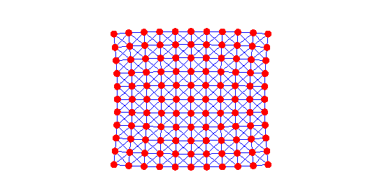
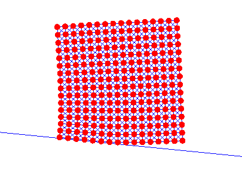
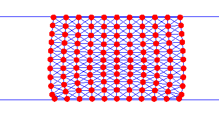
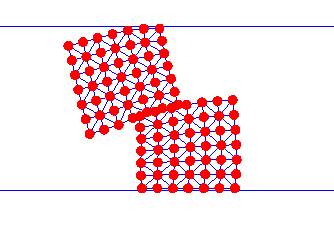

# MUDA-based Solid Simulation Tutorial
This is a tutorial for elastodynamic contact simulation using [MUDA](https://github.com/MuGdxy/muda) (a [CUDA](https://developer.nvidia.com/cuda-toolkit) programming paradigm).

The basic architecture of the simulators follows [@liminchen](https://github.com/liminchen)'s Numpy version [solid-sim-tutorial](https://github.com/phys-sim-book/solid-sim-tutorial).

The tutorial (written by a beginner of simulation) aims at helping beginners learn how to write simple CUDA codes for efficient solid simulations on the GPU. An introductory section for the first example of this tutorial can be found at [https://phys-sim-book.github.io/lec4.6-gpu_accel.html](https://phys-sim-book.github.io/lec4.6-gpu_accel.html).

## Usage
1. Clone the repository
```bash
git clone https://github.com/Roushelfy/solid-sim-muda
cd solid-sim-muda
git submodule update --init --recursive
```

2. build with cmake
```bash
mkdir build
cd build
cmake ..
cmake --build .
```

## Requirements
Eigen3==3.4.0

CMake>=3.29

CUDA>=11.0

## Examples

### 1. Simple Mass-Spring System

### 2. Dirichlet Boundary Condition

### 3. Contact

### 4. Friction

### 5. Moving Dirichlet Boundary Condition

### 6. Neohookean Solids

### 7. Neohookean Solids with Self-Contact

### 8. Neohookean Solids with Frictional Self-Contact

